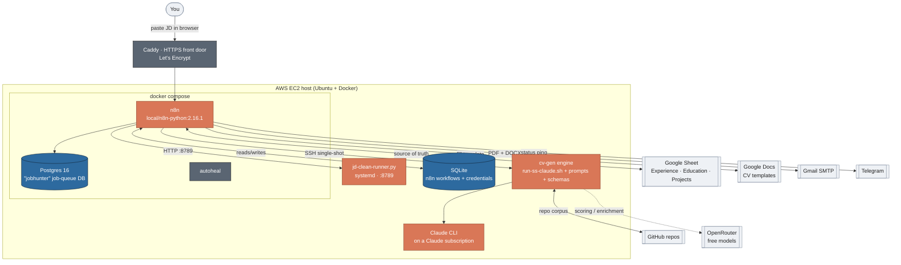
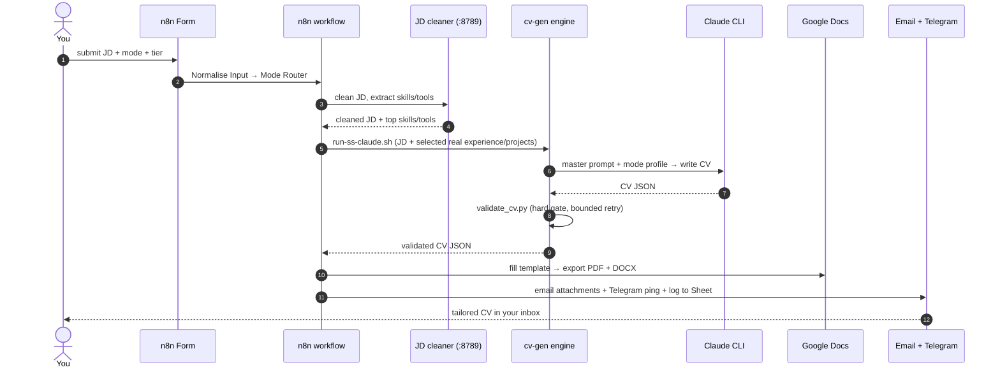
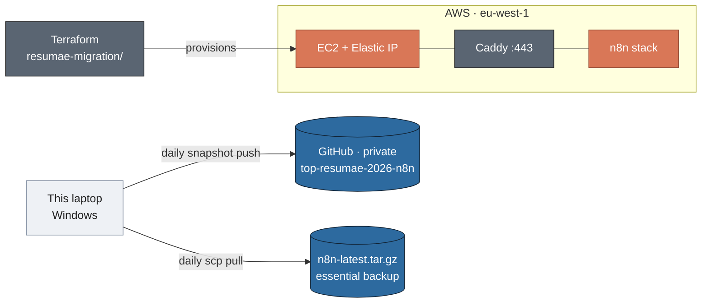

# TOP RESUMAE 2026

> Paste a job description → get a truthful, JD-tailored CV as a polished PDF + DOCX, emailed to you in minutes.


This repository is the **complete, secret-free backup and rebuild source** for *TOP RESUMAE 2026* — a personal, automated CV-tailoring pipeline built in [n8n](https://n8n.io) with a Claude-powered generation engine. It was used during a real job hunt: you paste a job description into a web form, and a few minutes later a tailored, ATS-aware CV lands in your inbox as a PDF and a DOCX.

> ⚠️ **Private & personal.** This repo contains the author's **real career data** (`cv-gen/source_of_truth.json` — real employment history, education, projects). It holds **no secrets** (see [What's deliberately *not* here](#-whats-deliberately-not-here)), but it is not for public distribution. Share only with people you trust.

---

## Contents
- [What it does](#what-it-does)
- [Live demo](#live-demo)
- [What it costs](#what-it-costs)
- [Quick start (restore & run)](#quick-start-restore--run)
- [Features](#features)
- [Architecture](#architecture)
- [How the engine works](#how-the-engine-works)
- [What's deliberately not here](#-whats-deliberately-not-here)
- [Repo layout](#repo-layout)
- [Status & provenance](#status--provenance)
- [Author's notes](#authors-notes-)
- [License](#license)

---

## What it does

You fill in a short web form ("Dream Resumae 2026") with a **job description**, a **CV mode** (professional, graduate, research, …) and a **quality tier**. The pipeline then:

1. **Cleans the JD** and extracts the skills/tools a recruiter is really scanning for.
2. **Selects your most relevant real experience and projects** from a source-of-truth Google Sheet + your GitHub repos.
3. **Writes the CV** with the Claude CLI running on the server — tailored to the JD, grounded in your real history, and shaped to pass ATS keyword checks without reading like a keyword dump.
4. **Validates** the result against a hard schema (bullet counts, no AI-tells, correct sections).
5. **Renders** it into your Google Doc template → exports **PDF + DOCX**.
6. **Delivers** it by email, pings you on Telegram, and logs the run to a Google Sheet.

**Ask → get, concretely:**

> *Paste a "Data Engineer" JD → within ~4 minutes receive `Gautham_Binoy_Data_Engineer.pdf` + `.docx`, with your most cloud/data-relevant roles surfaced, real projects attached, one quantified bullet per role, and the JD's must-have tools woven through the experience — not just dumped in a skills list.*

---

## Live demo

Not currently live. This is a **backup/restore repository** — the running instance lived on AWS and has since been retired. Anyone with the secrets can stand it back up in ~30 minutes (see [Quick start](#quick-start-restore--run)). The last running URL was `https://n8n.<elastic-ip>.nip.io` behind Caddy auto-HTTPS.

## What it costs

Designed to run **cheaply**:

| Piece | Cost |
|---|---|
| Compute | One small AWS EC2 box (~$30/mo on t3.medium; runs on free-tier-class hardware) |
| CV writing | **Claude CLI on a Claude subscription** (no per-token API bill) |
| Scoring / repo enrichment | **OpenRouter free models** (`gpt-oss-120b:free` → fallback chain), $0 |
| HTTPS | **Caddy + Let's Encrypt**, free |
| Notifications / storage | Telegram Bot + Gmail SMTP + Google Sheets/Docs, free tiers |

## Quick start (restore & run)

Full step-by-step (with the sharp edges called out) is in **[`RESTORE.md`](RESTORE.md)**. The short version, on a fresh Ubuntu box with Docker + git:

```bash
# 1. Clone
git clone https://github.com/gauthambinoy/resumae-2026-n8n.git ~/resumae && cd ~/resumae

# 2. Build the custom n8n image (n8n + Python in one image — it is NOT on any registry)
docker build -t local/n8n-python:2.16.1 n8n/

# 3. Restore the n8n data volume (workflows + credentials live here, as SQLite)
#    Either recreate empty …                       docker volume create n8n_n8n_data
#    … or restore it from your latest essential backup tarball (recommended).

# 4. Configure & bring up the stack
cd n8n && cp .env.example .env      # then fill EVERY value from your secret store
docker compose up -d                # n8n + postgres + autoheal

# 5. Import the workflows (only if you started from an empty volume)
docker cp workflows_all.json n8n:/tmp/
docker exec n8n n8n import:workflow --input=/tmp/workflows_all.json
docker exec n8n n8n update:workflow --id=S5UYbSbCFhMFpCWc --active=true
docker restart n8n

# 6. Put the HTTPS front door up (n8n only listens on localhost)
#    Install Caddy on the host, drop in n8n/Caddyfile.example → /etc/caddy/Caddyfile, edit the domain.
sudo systemctl reload caddy
```

Then open the Form URL and submit one test JD to confirm a PDF/DOCX is emailed. **The system needs your secrets to run — they are intentionally not in this repo.**

## Features

- **Six CV modes** — professional, graduate, research, retail, healthcare, hospitality — each with its own profile and JSON schema.
- **Three quality tiers** — Fast (Sonnet), Balanced (Opus), Ultra Premium (Opus, more thinking) — mapped in the workflow's `Normalise Input` node.
- **JD-driven tailoring** — a dedicated JD cleaner (Claude Sonnet, host service on port 8789) extracts must-have skills/tools and forces them into the experience bullets, not just the skills list.
- **Source-of-truth data** — a 3-tab Google Sheet (Experience / Education / Projects) plus a live GitHub-repo sync feed real, verifiable content into every CV.
- **Dynamic experience & project selection** — `select_relevant.py` picks the most JD-relevant real roles and repos per application.
- **Hard validation gate** — `validate_cv.py` fails malformed output (wrong bullet counts, AI-tells, wrong sections) and triggers a bounded retry.
- **Truthful by design** — content is grounded in real history; a believability guard refuses to fabricate a trade the candidate never worked.
- **Multi-channel delivery** — PDF + DOCX by email, Telegram ping, Google Sheet run-log.
- **Free-model fallback chain** — `llm_free.py` degrades gracefully across free OpenRouter models before falling back to a heuristic.
- **Self-healing infra** — Docker `autoheal` restarts unhealthy containers; nightly backups.

## Architecture

**Component architecture** — the running system on the server:


*Every node above maps to a real file or service: `n8n/docker-compose.yml`, `cv-gen/jd-clean-runner.py`, `cv-gen/run-ss-claude.sh`, the Caddy front door, and the external Google/GitHub/OpenRouter boundaries.*

**CV generation flow** — the happy path for one submission:



**Deployment topology** — how it was hosted and backed up:



## How the engine works

The CV writing does **not** happen inside n8n and **not** via an LLM API. n8n orchestrates; the actual generation is the **Claude CLI running on the host**, invoked over SSH by `cv-gen/run-ss-claude.sh`:

- **`prompts/master_single_shot.md`** — the master prompt (all the rules: structure, bullet grammar, coverage, believability, ATS).
- **`modes/<mode>.profile.md`** — per-mode overrides (professional, graduate, …).
- **`schemas/<mode>.schema.json`** — the shape the output must satisfy.
- **`source_of_truth.json`** — real experience/education/projects, generated from the Google Sheet by `sheet_to_json.py` and from GitHub by `github_corpus_v3.py`.
- **`select_relevant.py`** — chooses the most JD-relevant real roles + projects for this application.
- **`validate_cv.py`** — the hard gate; on failure the runner retries before delivering the best result.

Tiers map to models in the workflow's `Normalise Input` node: **Fast** = Claude Sonnet (Opus fallback), **Balanced** and **Ultra Premium** = Claude Opus. Scoring and GitHub-repo enrichment use **free OpenRouter models** via `llm_free.py`.

## 🔒 What's deliberately *not* here

This repo is secret-free by design (enforced by `.gitignore` **and** the snapshot script's redaction gate). To run the system you must supply these separately, from your own password store:

| Secret | Goes to |
|---|---|
| Google Sheets OAuth (client id/secret/refresh token) | `~/cv-gen/.gsheets.json` |
| GitHub personal access token | `~/cv-gen/credentials/github.token` |
| OpenRouter API key | `~/cv-gen/credentials/openrouter.key` |
| Claude CLI login | interactive — `claude` then `/login` |
| n8n `.env` (Postgres pw, Telegram, API keys) | `~/n8n/.env` (from `.env.example`) |
| n8n credentials (Google, Gmail SMTP, Telegram, Postgres) | re-enter in n8n UI, or restore the n8n data volume |

Two host-only files are also **not** in the backup and must be recreated on restore — see `RESTORE.md`: the patched `node-types.js` (bind-mounted into n8n) and the Caddy config (a template is provided as `n8n/Caddyfile.example`).

## Repo layout

```
resumae-2026-n8n/
├── README.md                  ← you are here
├── RESTORE.md                 disaster-recovery runbook (read before rebuilding)
├── ROADMAP.md                 build history & plan  (internal log)
├── JOURNAL.md                 session-by-session build story  (internal log)
├── .gitignore                 belt-and-suspenders secret exclusion
├── cv-gen/                    the CV-generation "brain" (runs on the host)
│   ├── prompts/               master_single_shot.md (+ _fast) — the master prompt
│   ├── modes/                 6 mode profiles
│   ├── schemas/               per-mode JSON schemas
│   ├── run-ss-claude.sh       the single-shot Claude runner (main engine)
│   ├── validate_cv.py         hard-gate CV validator
│   ├── sheet_to_json.py       Google Sheet → source_of_truth.json
│   ├── select_relevant.py     JD → most-relevant experiences/projects
│   ├── github_corpus_v3.py    GitHub repos → Projects tab
│   ├── llm_free.py            free-model fallback chain
│   └── source_of_truth.json   generated real profile data
└── n8n/
    ├── docker-compose.yml      n8n + postgres + autoheal stack
    ├── Dockerfile              custom n8n + Python image
    ├── Caddyfile.example       HTTPS reverse-proxy template (front door)
    ├── sql/                    Postgres schema + seed for the job-queue DB
    ├── .env.example            environment template
    └── workflows_all.json      ALL n8n workflows (incl. TOP RESUMAE 2026, id S5UYbSbCFhMFpCWc)
```

**Workflows captured** in `workflows_all.json`: *TOP RESUMAE 2026 — Claude + Codex* (the CV maker), *Job Radar — Multi-source AI*, *TOP RESUMAE ERROR ALERT*, and the *Telegram CV Bot*.

## Status & provenance

- **State:** archived backup. The live instance ran on AWS (migrated across accounts as they were retired) and is currently down.
- **Freshness:** the git snapshots run to **2026-07-20**; the separate n8n essential backup tarball is as of **2026-08-02**. Both are complete, working versions.
- **Automation:** a daily Windows task snapshotted the box into this repo (`make-resumae-git-snapshot.sh` + `daily-git-refresh.ps1`) with a redaction gate so no secret could ever leave the box.

> Some canonical README sections (CI/CD pipeline, hero GIF, screenshot grid) are intentionally **omitted**: this is a private backup repo with no CI pipeline, and no product screenshots are included because the no-fake-data rule forbids staging them and the live instance is retired.

## Author's notes ✍️

*These sections are the author's own reflections to complete — left as prompts, not filled in on his behalf.*

- **Productionizing & scaling** — ✍️ TODO: your words.
- **Key technical decisions & why** — ✍️ TODO: your words.
- **Engineering standards I followed (and skipped)** — ✍️ TODO: your words.
- **How I used AI tools in development** — ✍️ TODO: your words.
- **What I'd do differently with more time** — ✍️ TODO: your words.
- **Edge cases knowingly skipped** — ✍️ TODO: your words.

## License

Proprietary — © 2026 Gautham Binoy. All rights reserved. Personal project; not licensed for redistribution or reuse.
